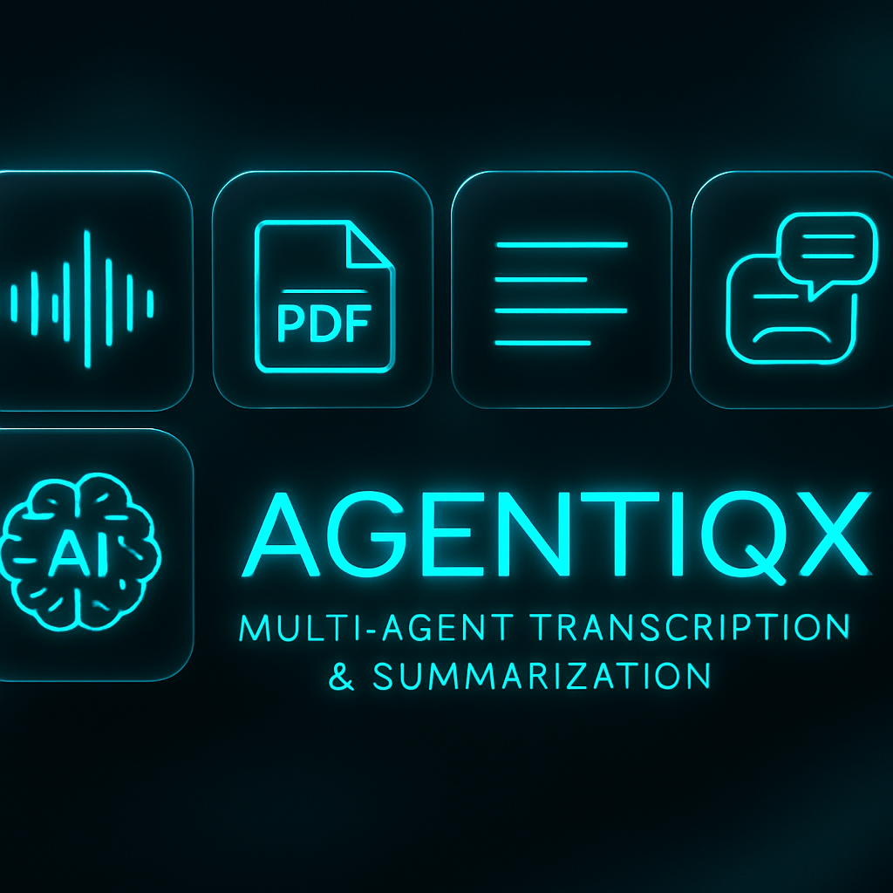

# **AgentIQX** 🚀
*Modern Multi-Agent Audio/Video/PDF Transcription & Summarization App*




[](https://www.python.org/)  
[](https://gradio.app/)  
[](https://github.com/openai/whisper)  
[](https://github.com/facebookresearch/faiss)  
[](https://ollama.com/)  
[](https://pypi.org/project/PyPDF2/)  
[](https://pypi.org/project/gTTS/)  
[](LICENSE)

---

## **💻 Tech Stack**
| Layer | Technology |
|-------|-----------|
| **Frontend/UI** | Gradio Blocks, Custom CSS (Glassmorphic, Dark/Cyan theme) |
| **Transcription** | OpenAI Whisper (local GPU/CPU) |
| **Summarization / LLM** | Ollama (TinyLlama, DeepSeek, Phi3) |
| **Retrieval / Search** | SentenceTransformers (all-MiniLM-L6-v2), FAISS |
| **PDF Handling** | PyPDF2, PyMuPDF |
| **Text-to-Speech** | gTTS (local), pyttsx3 |
| **Email Automation** | SMTP, dotenv credentials |
| **Utilities** | Python 3.11+, Logging, Chunking, FAISS Index Management |

---

## **✨ Key Features**

### **1. Transcribe Anything**
- Upload PDFs, audio (mp3/wav), or video (mp4/m4a/mov).  
- Multi-method extraction ensures accurate transcripts via **Whisper**, **PyPDF2**, and **PyMuPDF**.  

### **2. Flexible Summarization**
- Generate concise, detailed, bulleted, numbered, or paragraph-style summaries.  
- Focus on custom sections or areas of interest using local LLMs (**Ollama**).  

### **3. Retrieval-Augmented QA (RAG)**
- Ask questions about your documents.  
- Relevant chunks retrieved via embeddings & **FAISS**.  
- Answers generated by LLM with full context grounding.  

### **4. Step-by-Step Explanations**
- Automatically generate **pedagogical rationales** for any answer.  
- Ideal for teaching, learning, or auditing LLM decisions.  

### **5. Semantic Embedding & Chunk Management**
- Text is split into word-overlapped chunks, embedded, and indexed with **FAISS**.  
- Supports fast similarity search and RAG pipelines.  

### **6. Text-to-Speech (TTS)**
- Convert any summary or transcript to speech locally.  
- Audio is playable in-browser or downloadable as **MP3**.  

### **7. Email Automation**
- Send summaries or transcripts via SMTP with **.env-based secure credentials**.  
- Live validation and status feedback in UI.  

### **8. Glassmorphic, Responsive UI**
- Smooth, intuitive **tab navigation**.  
- Dark/cyan neon-glass theme with **glowing buttons**.  
- Forward/backward navigation between workflow tabs.  

### **9. Robust Logging & Error Handling**
- Detailed logs for each agent.  
- Error propagation surfaced to UI for easy debugging.  

---

## **🗂 Project Structure**

app.py # Main Gradio app & workflow orchestration
agents/
├─ embed_agent.py # Embedding & FAISS index management
├─ explain_agent.py # Step-by-step explanation generator
├─ llm_agent.py # LLM orchestration & prompt handling
├─ ollama_agent.py # Local LLM interface (TinyLlama/DeepSeek)
├─ pdf_agent.py # Multi-method PDF extraction & chunking
├─ rag_agent.py # RAG pipeline orchestration
├─ video_agent.py # Audio/video transcription with Whisper
utils/
├─ chunking_utils.py # Text chunking & embedding helpers
├─ faiss_utils.py # FAISS index save/load/query
├─ summary_agent.py # Summarization logic & style handling
├─ transcript_utils.py # File transcript extraction & saving
├─ tts_utils.py # Text-to-speech pipeline
├─ emails_utils.py # SMTP email sender
├─ whisper_utils.py # Whisper loader & GPU auto-selection
├─ init.py # dotenv loader for secrets
style.css # Glassmorphic, dark-themed CSS
.env # Email credentials (SENDER_EMAIL, SENDER_PASSWORD)


---

## **📊 Workflow Overview**

1. **Upload & Extract** → PDF / Audio / Video → Raw text via Whisper & multi-method extraction.  
2. **Chunk & Embed** → Text split into chunks, embedded (SentenceTransformers), indexed (FAISS).  
3. **Summarize** → Select style, level of detail, focus areas → Local LLM returns summary.  
4. **TTS & Email** → Speak summary using gTTS → Email via SMTP with secure validation.  
5. **RAG Q&A** → Ask questions → Relevant chunks retrieved → Answer generated.  
6. **Explain Agent** → Generate step-by-step rationale for any answer/context.  

---

## **⚡ Advanced Features**
- **Cached embeddings & indices** for speed.  
- **Lazy agent loading** for efficient memory usage.  
- **Full error propagation** to UI.  
- **Drop-in alternative models** by editing a single config line.  
- **Privacy-first design** — no cloud calls; all processing local.  

---

## **🚀 Getting Started**
```bash
# Create a fresh virtual environment and install dependencies
pip install -r requirements.txt

# Set up .env for email credentials
echo "SENDER_EMAIL=your_email@domain.com\nSENDER_PASSWORD=yourpassword" > .env

# Launch AgentIQX
python app.py
